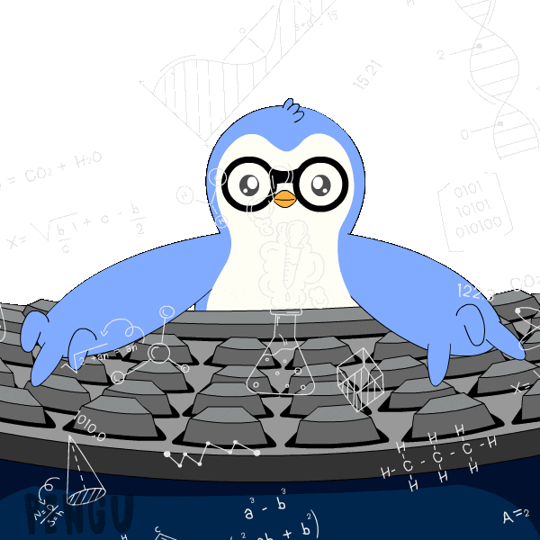

## Hi there, I'm Akhilesh 

📚 BTech in EEE at National Institute of Technology , Surathkal , India 

👨‍💻 Learning about ML System Design , Natural Language Processing and Computer Vision  
 

---

### 🔧 Languages & Tools:

---

### 📘 Projects:
- 🔍 **[OCR Pipeline](https://github.com/yourusername/ocr-project)** – Damage detection & car-part segmentation using Mask R-CNN  
- 📊 **[Medical QA RAG System](https://github.com/yourusername/medical-rag)** – Graph-based retriever using Neo4j and Tavily fallback  

---

📫 **Reach me at**: [LinkedIn](https://linkedin.com/in/your-profile)

<!--
**Akhilesh0013/Akhilesh0013** is a ✨ _special_ ✨ repository because its `README.md` (this file) appears on your GitHub profile.

Here are some ideas to get you started:

- 🔭 I’m currently working on ...
- 🌱 I’m currently learning ...
- 👯 I’m looking to collaborate on ...
- 🤔 I’m looking for help with ...
- 💬 Ask me about ...
- 📫 How to reach me: ...
- 😄 Pronouns: ...
- ⚡ Fun fact: ...
-->
